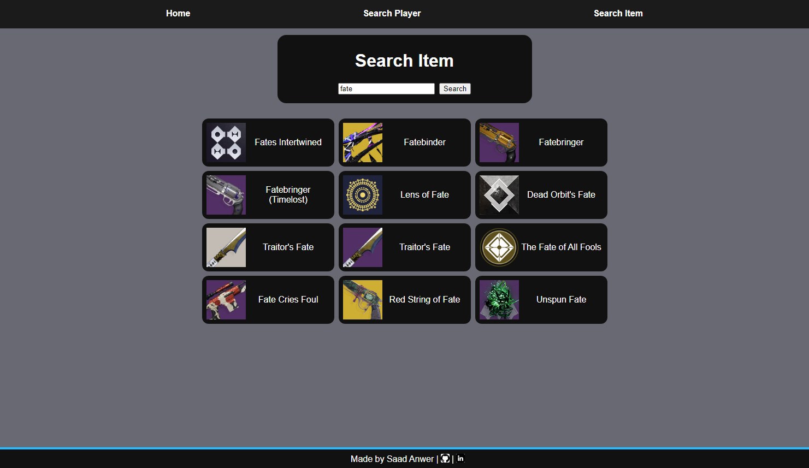

# $$LFPeek: A \space Destiny \space 2 \space Profile \space and \space Item \space Inspector$$
$${\color{orange}by \space Saad \space Anwer}$$

# About
LFPeek is a website that makes use of Bungie's API for the game Destiny 2 to allow users to search and inspect items and other players.

The live site can be accessed [here](https://lfpeek.vercel.app/).

### Project Demo

## Features:
- Player Search
- Player Inspection
- Item Search
- Item Inspection

### Planned Features for the Future:
- OAuth integration
- Item Swap

## Technologies Used:
- JS
- Vite
- React
- Redux

## Getting Started Locally
### NOTE: Requires your own Bungie API environment variables
- cd into `vite-project`
- Create a `.env` inside the directory and enter your environment variables under the names `VITE_API_KEY`, `VITE_CLIENT_ID`, and `VITE_CLIENT_SECRET` respectively
- Run `npm i` in the terminal. This will install all the necessary dependencies including those made for Bungie's API
- Run `npm run dev` to start the project in your localhost
